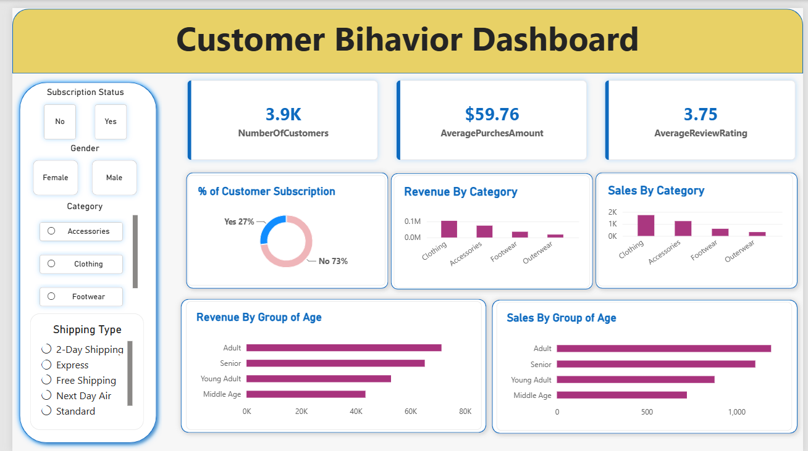

# Customer Shopping Behaviour Analysis

##  Project Overview

Customer Shopping Behavior Analysis is an end-to-end data analytics project designed to analyze customer purchasing patterns, sales performance, product demand, and customer demographics.

The project uses **Python, Pandas, MySQL, SQL, Power BI, and DAX** to transform raw customer shopping data into meaningful business insights.

The final analysis is presented through an interactive **Power BI dashboard** that helps understand customer behavior and identify important sales trends.

---

##  Objectives

The main objectives of this project are:

- Analyze overall sales and revenue performance
- Understand customer purchasing behavior
- Identify the most frequently purchased products
- Analyze sales performance by product category
- Compare purchasing behavior by gender
- Analyze customer age groups
- Understand seasonal sales trends
- Analyze subscription status and customer spending
- Analyze the impact of discounts
- Identify important business insights using data visualization

---

## Tools & Technologies

- **Python**
- **Pandas**
- **Jupyter Notebook**
- **MySQL**
- **SQL**
- **Power BI**
- **DAX**
- **CSV Dataset**
  
# Power BI Dashboard

# Dataset
The dataset contains customer shopping information such as:

Customer ID
Age
Gender
Item Purchased
Category
Purchase Amount
Location
Size
Color
Season
Review Rating
Subscription Status
Discount Applied
Frequency of Purchases
The dataset contains 3,900 customer shopping records.

# Python & Pandas
Python and Pandas were used for data loading, exploration, and analysis.

Main tasks included:
Loading the CSV dataset
Inspecting the dataset
Understanding columns and data types
Data cleaning
Exploratory data analysis
Calculating important statistics
Preparing data for further analysis

# MySQL & SQL Analysis
The dataset was imported into MySQL for SQL-based analysis.
The following analyses were performed:

Total number of customers
Total revenue
Average purchase amount
Purchases by category
Revenue by category
Top 10 purchased products
Gender-wise revenue analysis
Top customers by spending
Subscription status analysis
Discount analysis
Seasonal sales analysis
Location-wise sales analysis
Purchase frequency analysis
Age group analysis
Review rating analysis
Size-wise sales analysis
Color-wise sales analysis

# Power BI Dashboard
Power BI was used to create an interactive dashboard for visualizing the analysis.

Key KPIs
Total Revenue
Total Customers
Average Purchase
Total Orders
Dashboard Visualizations
Revenue by Category
Orders by Category
Revenue by Gender
Revenue by Season
Top 10 Products by Orders
Revenue by Age Group
Revenue by Subscription Status

# Key Business Insights
Some important insights identified from the analysis include:

Clothing is the largest product category by both order volume and revenue.
Accessories is the second-largest contributor to revenue.
The analysis identifies the products with the highest purchase frequency.
Older customer groups contribute significantly to overall revenue.
Seasonal analysis helps identify differences in purchasing behavior across seasons.
Subscription status can be compared to understand differences in customer spending.
Customer demographics such as gender and age provide useful information for targeted marketing strategies.

# Business Recommendations
Based on the analysis, businesses can:

Focus marketing efforts on high-performing product categories.
Promote frequently purchased products.
Create targeted campaigns for high-value customer segments.
Use seasonal trends to optimize inventory and promotions.
Develop strategies to increase subscription adoption.
Analyze discount effectiveness before launching future promotions.

# Conclusion

This project demonstrates an end-to-end data analytics workflow, starting from raw customer shopping data and transforming it into actionable business insights.
It showcases practical skills in Python, Pandas, SQL, MySQL, Power BI, and DAX, making it a useful portfolio project for a Data Analyst role.

# Author

**Md Ahsanul Haque**

Aspiring Data Analyst
Skills: Python | Pandas | SQL | MySQL | Power BI | DAX | Excel
